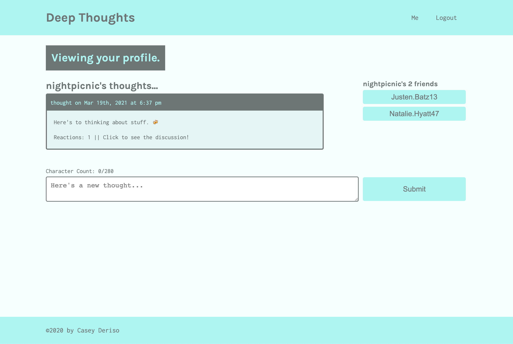

# Deep Thoughts

    

## Description

Deep Thoughts is a MERN stack social media application. This application allows users to view content in the form of 280 character thoughts and reactions. Once a user signs up for the application, they can post their own thoughts and reactions as well as add others to their friends list. logged in users stay authorized with a JSON Web Token that is stored on the client side. Thoughts, reactions and user data is stored in a MongoDB server, CRUD operations are performed through a graphQL API and the front end is powered by react, apollo react hooks, and React Router DOM.

## Table of Contents:
* [Installation](#installation)
* [Usage](#usage)
* [Screenshot](#screenshot)
* [Credits](#credits)

## Installation 

This projects development environment is using concurrently to run both the databse and client servers. If you prefer to run two separate terminals, do not run 'npm start' in the root directory. 

## Usage 

This project is a good starting point for a performant social media application. 

## Screenshot

      

## Credits

UT Austin Coding Bootcamp

## License 

MIT
